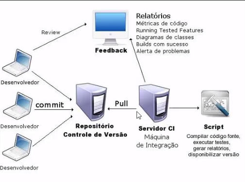

# Iniciando com o Jenkins

## Seção 1

1. Introdução
    - O Jenkins é um software de automação Open Source, que pode ajudá-lo a automatizar tarefas técnicas, repetitivas, envolvidas na integração e entrega contínua de software. Dentre suas funcionalidades principais, podemos citar: compilar projetos de software, executar testes automatizados, fazer a implantação em diferentes ambientes, gerar alertas quando algo não está certo, entre outras várias funções. Neste treinamento, demonstraremos como instalar e configurar o Jenkins e como criar simples jobs através do console.

2. Entendendo o processo de integração contínua
    - Entendo em que local o Jenkins se encaixa
    

3. Instalando o Jenkins
    - <https://www.jenkins.io/> site do Jenkins
    - Instalando o Jenkins em um Ubuntu
    - `apt install default-jdk` para instalar o Java no servidor
    - `sudo wget -O /usr/share/keyrings/jenkins-keyring.asc https://pkg.jenkins.io/debian-stable/jenkins.io-2023.key` baixando a chave pública do repositório
    - `echo deb [signed-by=/usr/share/keyrings/jenkins-keyring.asc] https://pkg.jenkins.io/debian-stable binary/ | sudo tee /etc/apt/sources.list.d/jenkins.list > /dev/null` adicionando repositório a lista.
    - `apt update` && `apt install jenkins` para atualizar a lista de repositórios e instalar o Jenkins.

4. Etapas pós instalação
    - `systemctl start jenkins` iniciando serviço do Jenkins
    - `http://IPDOSERVIDOR:8080` para acessar o serviço do Jenkins
    - Para acessar pela primera vez o Jenkins guarda uma senha em um local especifico, só realizar um `cat` e copiar a senha.
    - Instalação dos plugins sugeridos, mas a frente iremos ver a instalação de plugins
    - Etapa de criar um usuário administrador para o Jenkins

5. Executando o Jenkins no Docker
    - Criei um `docker-compose` para subir um container com o Jenkins
    - `docker logs IDCONTAINER` para verificar informações se o Jenkins subiu corretamente
    - Conclusão da instalação, pegando a senha inicial no local informado e criando usuário admin para o Jenkins

6. Explorando a console web
    - Explorando de fato todas as telas do Jenkins

7. Integrando Git com GitHub
    - Criando um repositório para jobs, no meu caso criei um diretório separado aqui mesmo nesse repositório.
    - Criando um arquivo java para testes.
    - Efetuando o push do arquivo java

8. Criando uma simples Job
    - Instalando um plugin `GitHub Authentication`
    - Criando uma nova tarefa ou job.
    - Adicionando um repositório Git.
    - Explicando todas as opções do Job.
    - Verificando o Workspace do projeto criado.

9. Trabalhando com variáveis de ambiente
    - Verificando as variáveis de ambiente do Jenkins.
    - Execuntando print de algumas variáveis.
    - Instalando um novo plugin chamado `build-name-setter`
    - Personalizando o Build Name com o plugin instalado.
    - Instalando um novo plugin chamado `user-build-vars`
    - Utilizando o novo Plugin

10. Configurando notificação por e-mail
    - 

    